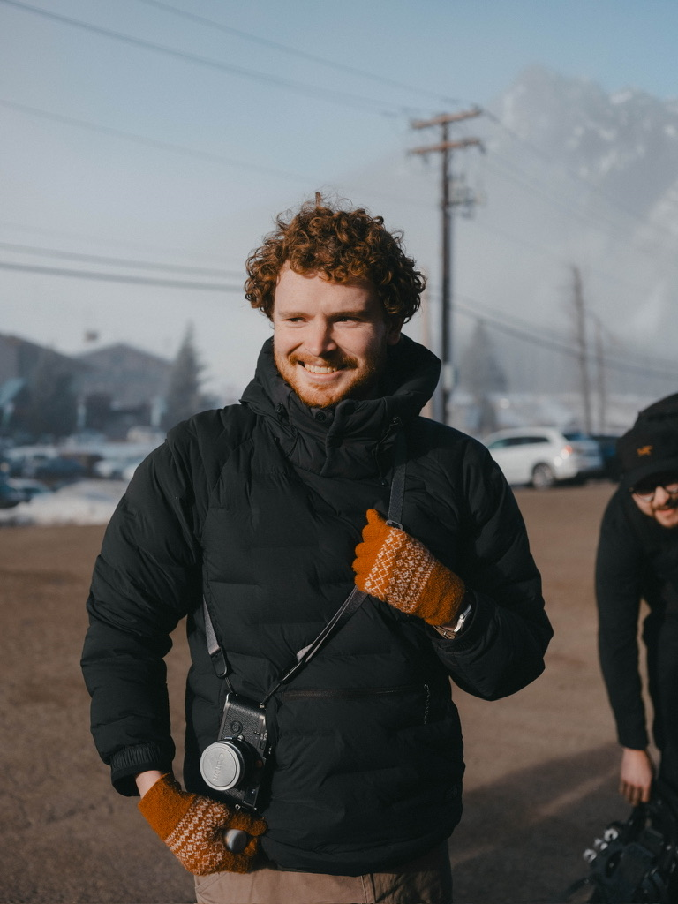

After multiple instances of people asking for a professional website of my work I have realized the format of image and limitedd text was not a proper representation of my abilities. I have decided to update the website to continue the rolling "best of" homepage of my work but change the content to semi-monthly work updates. This more relaistically aligns with the work I do in the darkroom as images take significantly longer to make. I hope to also include slice of life and travel photography in these posts, but the pressure to constantly produce internet friendly images means I go long periods without updating the site.

Happy shooting!